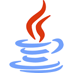

# <!--fit--> :boom: TOP LENGUAJES DE PROGRAMACION :boom:
# <!--fit--> AZAEL :es:

---
# TOP 1:

# JAVA :dollar: 
# :star: :star: :star: :star: :star:
> GRAN LENGUAJE ENSEÑADO POR GRAN TEACHER
---
# TOP 2:

# CSS :zzz:
# :star: :star: :star: :star:
> GRAN LENGUAJE Y FACIL DE UTILIZAR (RELLENO) 
---
# TOP 3:

# PYTHON :zzz:
# :star: :star: :star:
> NO LO HE UTILIZADO, PERO MOLA (RELLENO) 
---
# TOP 4:

# HTML :zzz:
# :star: :star:
> TERRIBLEMNTE FEO SIN SU PAREJA LLAMADA CSS (RELLENO) 

---
# TOP 5:

# C++ :zzz:
# :star:
> PORQUE NO SE ME OCURRIA UN TOP 5 (RELLENO JAJAJA) 
